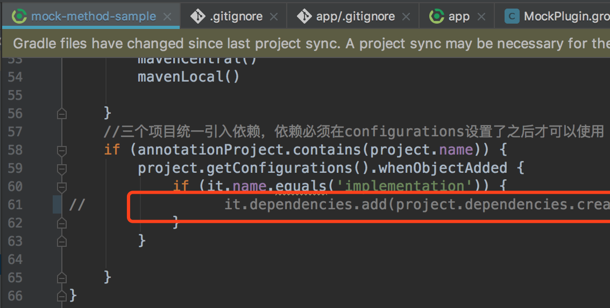

# mock-method-sample
* 使用场景
    * 调试阶段，非调试的逻辑影响了我们调试逻辑，我们使用注解@MockMethod方法轻松解决
        * 四宫格和六宫格切换
        * vip和非vip的场景切换

    

* 安装
    * app项目下注释 Plugin 和 Annotation 依赖代码

        

        

    * 将mock-method-plugin 上传到本地仓库
        * 选择右侧Gradle -> :mock-method-plugin -> upload -> uploadArchives
    * 将mock-mehtod-annotation 上传到本地仓库
        * 方法同上

            

    * 将annotation和plugin上传到本地仓库后恢复注释

* Mock 截图
    * java代码

        

    * 编译后的代码

        

* 原理
    * task-javac  ，进行生成了  MockMethodMap.class , 这个类提供运行时所有Mock的数据
    * task-transform，动态注入Mock代码